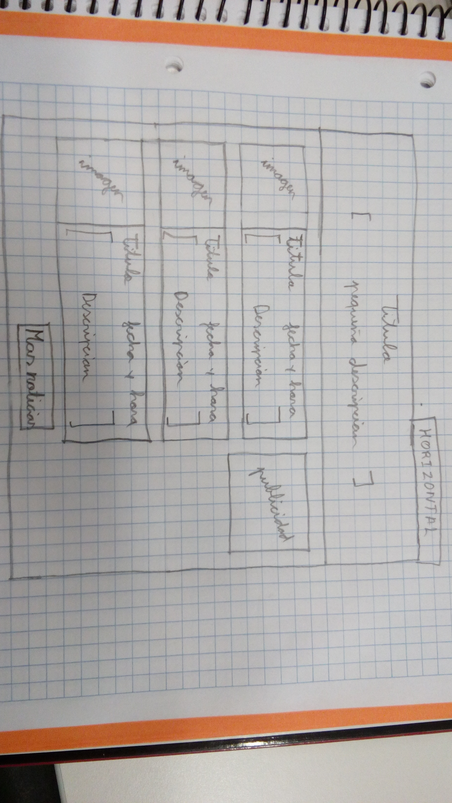
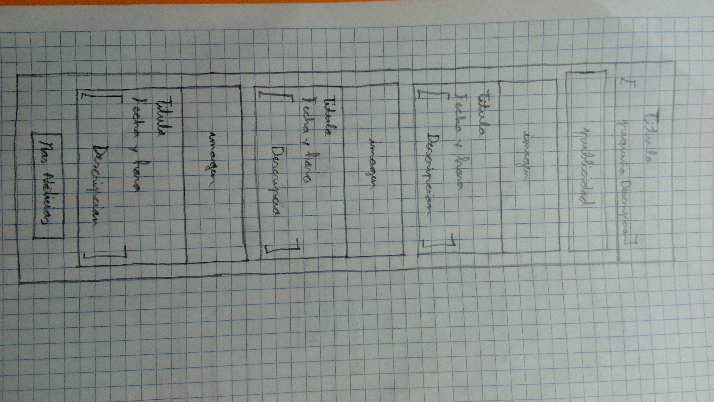

# Vida Terrestre
Aplicación de noticias con jQuery, Bootstrap, Html y CSS.

## Diseño Horizonte

#### El encabezado será un "div" de clase "jumbotron text-center" con:
  * El título de la página.
  * Una pequeña descripción de la página.
  
#### La publicidad estará en la caja de la derecha, cuando se haga scroll la caja desaparecera arriba.

#### Las cajitas centrales son las diferentes noticias, cada una mostrara la siguiente información:
 * Imagen pequeña a la izquierda.
 * Titulo de la noticia.
 * Fecha y hora de la publicación.
 * Descripción breve de la noticia.

#### Cargar mas noticias:
Practicaremos dos formas una sera con un boton "Mas novedades" que aperecera antes de llegar al final de la pagina y la otra
sera con un evento "scroll" que se activara cunado lleguemos a final de pagina, las dos formar realizaran la siguiente funcion:

Añadirá 3 noticias, debajo de estas tres ya escritas en el html. La información
de las noticias a carga se cogerán en un fichero "new.json". Esta acción se realizara dos veces, con diferentes
ficheros ".json" y cada vez se cargaran 3 noticias.

## Diseño Vertical

